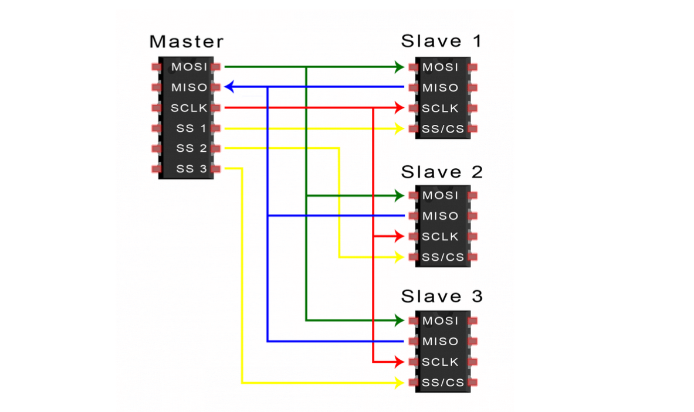
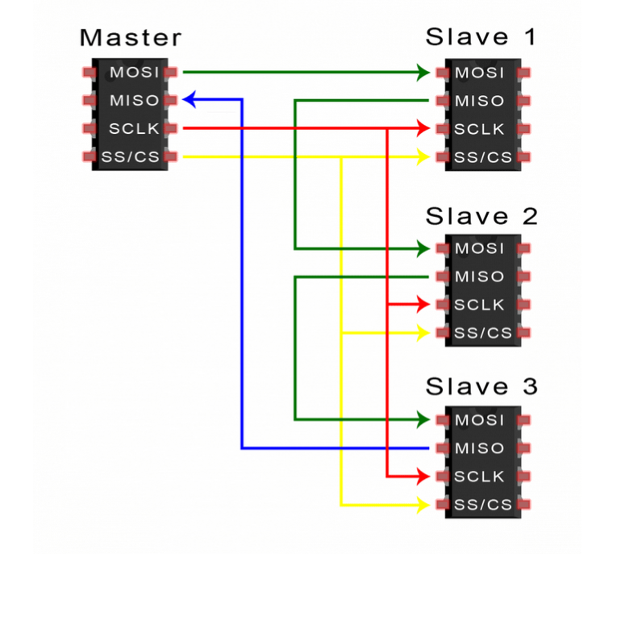

# Concepts

## Serial vs Paralel comunicatoin

_Paralel_ would be to connct all the
Lets send the letter 'C'.
Every 0 and 1 are connected via a vire
sender              reciever
0                   0
1                   1
0                   0
0                   0
0                   0
0                   0
1                   1
1                   1
clock               clock

Lets send the letter 'C' as _Serail_
there are only 2 vires and the data is sent as pulses.
01000011            01000011
clock               clock

ITs the proceses of sending information as current. If the curreent is 5v it is interpreted as 1 and if the voltage is 0 then it is interpreted as 0.
It also sends along the clock pulses so the other device know what is a pulse and can determin when a pulse startes and ends.

## SPI

Serial Periphial interface

Used by SD cards, 2.4GHz wireles transmiters/receivers, RFID cards.

Here data can be transfered with out interupts. Start and stop intigate the end and start of a packet. So data can be interpreted as it arrives.

Devices comunicaiting over SPI ar in a master and slave relationship.

MOSI master output/slave input - line for the master to send data to the slave.

MISO master input/slave output - Line for slave to send data to master

SCLK - line for clock signal

SS/CS slave select, chip select - line for master to select to witch slave to send data to.

### HOW SPI WORKS

#### THE CLOCK

The clock syncronizes the master and slave. One bit of data is transfered every clock cycle, so the speed is determined by the clock speed.
SPI communication is initiated by the master sice the maste configures and generates the clock signal.

Communication protocol where devices share the clock signal is know as a synchronos.

the clock can be modified by changing clock polarity and clock phase. These properties determin when the bits ar output and when they are sampled.
The master can use clock polarity to make the bits be sampled on the rising or falling edge.

Clock phase can be set for output and sampling to occure on either the first edge or the seccond edge.

### slave select

The master can select which slave it wants to talk to by setting the slaves CS/SS line to a low voltage level. In a idel state the slave select line is kept at a high voltage. Multiple SS/CS pins can be availabe on 1 master which allows for multiple slaves. If only ONE SS/CS pin is aivailable multiple slaves can be wired by using daisy-chaining.

### MULTIPLE SLAVES

Parralel wiering:

daisy wiering:

## I2C

Inter-Itegrated-Circut

## UART

universal asycronos reciver transmiter protocol.

aysycnornos protocol.

Works by seting a baud rate that bouth sides agree to.

## Rising and Falling 

When a voltage rises above 3.3 or 5V it is considered rising edge volate and would be encoded as 1 in GPIO.

When a voltage drops bellow 3.3 or 5V it is considered falling edge volate and would be encoded as 0 in GPIO.

When a voltage changes above or bellow 3.3 or 5V it is considered both edge any edge.

# micro controllers

## RP2040

### HARDWARE

#### Procesor
2 cores
133 MHz

#### Memmory
264KB

6 banks of 264 KB. Each bank can be used independetly.

are these banks used to store code? 
are theye used for malloc?

#### PIO(programmable Input output)
supports uncommon comunication protocols that maybe wear not intended to work with the microcontroller at manufacturing.

#### Dedicated hardeware for commun protocols

I2C, SPI< UAER and other have dedicated hardware blocks.

#### DEDICATED I/O for SPI flash(supporing XIP)

##### SPI flash
RP2040 does not have onboard falsh for prgoram storag, so it relies on ternal SPI flash memmory.
what does this mean?

##### Dedicated I/O for SPI flash

6pins are specifically reserved for high-speed communication with the flash memory, ensuring efficient execution.

##### XIP(eXecute In Place)
Allows for executing of code stored in SPI flash without copying it into SRAM first.
Saves sram and speed up execution.

##### 30 GPIO pins

what is `ring_oscilator`?

you can use it for true number generation. It is used a intial clocl source.
In application where clock is not important RP can function using the osicaltor for clock.
it oscilates so swithces between 1 and 0.

##### 3v3

3.3 V power. A source of 3.3V power the same voltage you Pico runs at internnally, generatef drom VSYS input. This power source can be swtiched on and off using the 3V3_EN pin above it, which also switches your Pico off.

##### VSYS

~2.5Volts power. Directly connected to picos power supply, which cannot be switched off without also witching Pico off.

##### VBUS

5V power. Taken from your Pico`s micro USB port and used to power hardware which needs more then 3.3V.

##### GND
0 volts ground. Ground connection used to complete a circut to a power source. Serveral of these pins are dotted aroudn your Pico to make wiring easier.

##### GPxx
general purpose input/output from GP0 to GP28

##### GPxx_ADXx
General purpose input/output pin number `xx` with analogue input number `x`.
GPIO which ends in `ADC` and a number can be used as an analodue input as well as a digital input or output but not both at the same time.

##### ADC_VREF
Analogue-to-digital converter (ADC) voltage reference
A special input pin which sets a reference voltage for any analogue inputs.

##### AGND

Analogue-to-digital converter (ADC) 0 volts ground

a special ground connectoin to use with ADC_VREF ping

##### RUN
Enabled or disabled your pico.
THe run header is used to start or stop your microcontroller from a nother headers.
